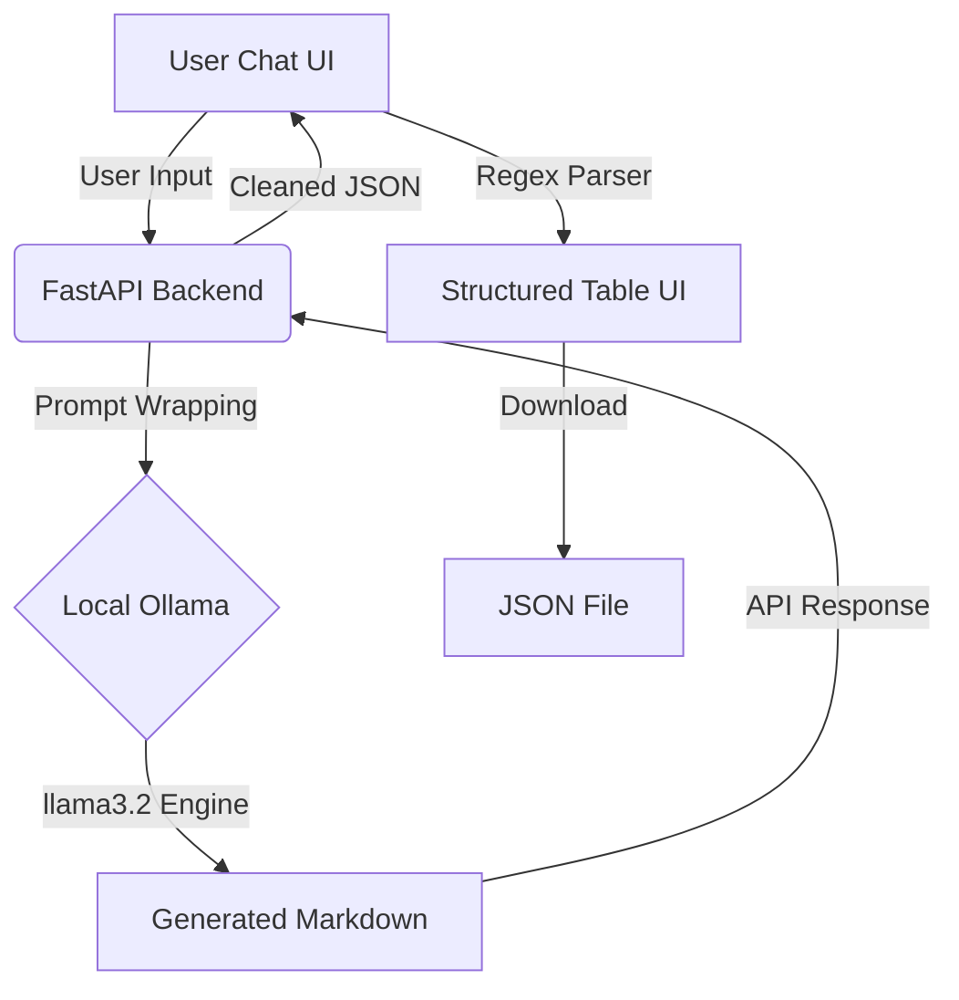

# Local Testcase Generator

A local-first testcase generator powered by Ollama (`llama3.2`) and FastAPI.

## Architecture


## Features
- **Local LLM**: Uses Ollama for data privacy and local execution.
- **FastAPI Backend**: Robust API for interacting with the LLM.
- **Vanilla Frontend**: Simple and clean Chat UI for generating testcases.
- **Prompt Templates**: Securely stored prompt templates for consistent output.

## Tech Stack
- **Backend**: Python, FastAPI, Ollama
- **Frontend**: HTML5, CSS3, JavaScript (Vanilla)

## Setup
1. Ensure [Ollama](https://ollama.com/) is installed and running.
2. Pull the model: `ollama pull llama3.2`
3. Install Python dependencies:
   ```bash
   pip install fastapi uvicorn requests pydantic python-dotenv
   ```
4. Run the backend:
   ```bash
   uvicorn backend.main:app --reload
   ```
5. Open `frontend/index.html` in your browser.

## Configuration
Update the `.env` file with your Ollama URL and model name:
```env
OLLAMA_URL=http://localhost:11434/api/generate
OLLAMA_MODEL=llama3.2
```
